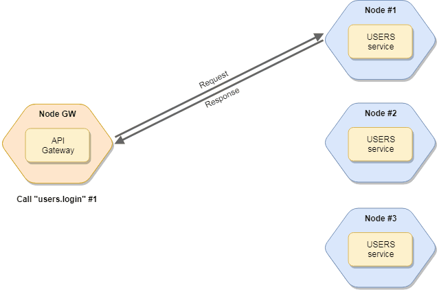

title: Actions
---

The actions are the callable/public methods of the service.
The action calling represents a remote-procedure-call (RPC).
It has request parameters and returns a response like an HTTP service.

If there are multiple instances of services, the broker
invokes instances according to the specified call strategy.
[Read more about balancing](balancing.html).

<div align="center">
    
</div>

## Call services
To call a service, use the `broker.call` method.
The broker looks for the service (and the node) that has the operation and calls it.
The function returns a [Promise](https://berkesa.github.io/datatree-promise/).

### Syntax
```java
Promise res = broker.call(actionName, params, opts);
```
The `actionName` is a dot-separated string.
The first part of it is the service name, while the second part of it represents the action name.
So if you have a `posts` service with a `create` action, you can call it as `posts.create`.

The `params` is an object which is passed to the action as a part of the [Context](#Context).
The service can access it via `ctx.params`.
In the Node.js-based Moleculer implementation, the 'params' is a JavaScript Object.
A JavaScript Object is a collection of named values:

Sample JavaScript Object:

```js
var params = {param1: "value1",
              param2: "value2",
              param3: 12345678,
              param3: true};
```

There is no similar native support for dynamic creation of JSON objects in Java language.
Because of this, the Java-based Moleculer implementation uses [Tree](https://berkesa.github.io/datatree/)
Objects to create hierarchical data structures.
The following Java code snippet builds similar JSON structure like the previous JavaScript code:

```java
Tree params = new Tree();
params.put("param1", "value1");
params.put("param2", "value2");
params.put("param3", 12345678);
params.put("param4", true);
```

The following Java statement...
```java
System.out.println(params);
```
... will print this:
```json
{
  "param1" : "value1",
  "param2" : "value2",
  "param3" : 12345678,
  "param4" : true
}
```

The `opts` is an CallOptions to set/override some request parameters,
for example `timeout`, `retryCount` or `nodeID`.
CallOptions can be produced using method chainig:

```java
CallOptions opts = CallOptions.nodeID("node-2").timeout(1500).retryCount(3);

Tree params = new Tree()
    .put("param1", "value1")
    .put("param2", "value2")
    .put("param3", 12345678)
    .put("param4", true);

Promise promise = broker.call("service.action", params, opts);

promise.then(rsp -> {
    logger.info("Response: " + rsp);
}).catchError(err -> {
    logger.error("Error!", err);            
});
```

If the request consists of simple name-value pairs, you do not need to create a Tree object as above.
The name-value pairs can be listed after the "service.action" parameter:

```java
broker.call("service.action",
            "param1", "value1",
            "param2", "value2",
            "param3", 12345678,
            "param4", true,
            CallOptions.nodeID("node-2").timeout(1500).retryCount(3)
            ).then(rsp -> {
                logger.info("Response: " + rsp);
            }).catchError(err -> {
                logger.error("Error!", err);            
            });
```

**Available calling options:**

| Name | Type | Default | Description |
| ------- | ----- | ------- | ------- |
| `timeout` | `Number` | `null` | Timeout of request in milliseconds. [Read more](fault-tolerance.html#Timeout) |
| `retries` | `Number` | `null` | Count of retry of request. If the request is timed out, broker will try to call again. [Read more](fault-tolerance.html#Retry) |
| `nodeID` | `String` | `null` | Target nodeID. If set, it will make a direct call to the given node. |

### Usages

**Call without params**

```java
broker.call("user.list").then(rsp -> {
    logger.info("User list: ", rsp));
});
```

**Call with params**

```java
broker.call("user.get", "id", 3).then(rsp -> {
    logger.info("User: ", rsp));
});
```

**Blocking style calling**

```java
Tree rsp = broker.call("user.get", "id", 3).waitFor();
logger.info("User: ", rsp);
```

**Call with options**

```java
broker.call("user.recommendation",
            "limit", 5,
            CallOptions.retryCount(3)).then(rsp -> {
               logger.info("User: ", rsp));
            });
```

### Metadata

The request structure may contain metadata. It can be name-value pairs or any structure.
Unlike the Node.js version, the Java version stores the metadata in params:

```java
Tree params = new Tree();
params.put("param1", "value1");
params.put("param2", "value2");

Tree meta = params.getMeta();
params.put("timestamp", new Date());
meta.putList("anArray").add(1).add(2).add(3);

broker.call("service.action", params).then(rsp -> {
    logger.info("Response: " + rsp);
});
```

The remote service can access the metadata block with the `ctx.params.getMeta()` function.

## Streaming

Moleculer-Java supports streams as request `params` and as response.
This is useful for uploading or downloading large files, or encoding/decoding the content.
This also allows you to transfer media files between services.

### Examples

**Sending bytes to a service**

```java
PacketStream stream = broker.createStream();
try {
    broker.call("service.action", stream);
    stream.sendData("some bytes".getBytes());
    stream.sendData("more bytes".getBytes());
} finally {
    stream.sendClose();
}
```

Please note, the `params` should be a stream, you cannot add other variables to the `params`.
Use the `meta` property to transfer additional data.

**Sending a file to a service**

```java
// Create stream
PacketStream stream = broker.createStream();

// Write filename into the meta block
Tree req = new CheckedTree(stream);
Tree meta = req.getMeta();
meta.put("filename", "avatar-123.jpg");

// Open connection
broker.call("storage.save", req).then(rsp -> {
    // Response received - transfer finished
});

// Start sending data in smaller packages
stream.transferFrom(new File("avatar-123.jpg"));
```

**Receiving the file at the service's side**

```java
@Name("storage")
public class StorageService extends Service {
    public Action save = ctx -> {
        String filename = ctx.params.getMeta().get("filename", "");
        return ctx.stream.transferTo(new File(filename));
    };
}
```

**Returning a stream as response at the service's side**

```java
public class StorageService extends Service {
    public Action get = ctx -> {
        String filename = ctx.params.getMeta().get("filename", "");
        PacketStream stream = broker.createStream();
        stream.transferFrom(new File(filename));
        return stream;
    };
}
```

**Process received stream at the caller's side**

```java
String filename = "avatar-123.jpg";
broker.call("storage.get", "filename", filename).then(rsp -> {

    // Response received
    PacketStream stream = (PacketStream) rsp.asObject();
    logger.info("Receiving file...");
    return stream.transferTo(new File(filename));

}).then(end -> {

    // Saving finished, `transferTo` completed
    // the previously returned Promise
    logger.info("Ok!");

}).catchError(err -> {

    // Downloading failed
    logger.error("Failed!", err);

});
```

## Context

When you call an action, the broker creates a `Context` instance which contains all request information
and passes it to the action handler as a single argument.

**Available properties & methods of `Context`:**

| Name | Type |  Description |
| ------- | ----- | ------- |
| `ctx.id` | `String` | Unique context ID |
| `ctx.name` | `String` | Action name (in "service.action" format) |
| `ctx.requestID` | `String` | Request ID. If you make nested-calls, it will be the same ID |
| `ctx.parentID` | `String` | Parent context ID (in nested-calls) |
| `ctx.params` | `Tree` | Request params including metadata (second argument from `broker.call`) |
| `ctx.level` | `int` | Request level (in nested-calls, the first level is `1`) |
| `ctx.startTime` | `long` | Timestamp of the context creation |
| `ctx.call()` | `Method` | Make nested-calls (same arguments like in `broker.call`) |
| `ctx.emit()` | `Method` | Emit an event (same as `broker.emit`) |
| `ctx.broadcast()` | `Method` | Broadcast an event (same as `broker.broadcast`) |
