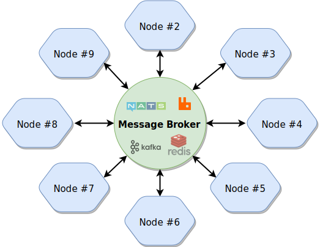

title: Networking
---
In order to communicate with other nodes (ServiceBroker instances) you need to configure a Transporter.
Most of the supported Transporters connect to a central message broker that provide a reliable way of exchanging messages among remote nodes.
These message brokers mainly support publish/subscribe messaging pattern.

<div align="center">
    
</div>

## Transporters

Transporter is an important module if you are running services on multiple nodes.
Transporter communicates with other nodes.
It transfers events, calls requests and processes responses ...etc.
If a service runs on multiple instances on different nodes, the requests will be load-balanced among live nodes.

The whole communication logic is outside of Transporter class.
It means switching between Transporters without changing any lines of our code is easy.

There are several built-in Transporters in Moleculer framework.

### TCP Transporter

TCP Transporter uses fault tolerant and peer-to-peer
[Gossip protocol](https://en.wikipedia.org/wiki/Gossip_protocol)
to discover location and service information about the other nodes
participating in a Moleculer Cluster. In Moleculer's P2P architecture all
nodes are equal, there is no "leader" or "controller" node, so the cluster is
truly horizontally scalable. This Transporter aims to run on top of an
infrastructure of hundreds of nodes.
 
It contains an integrated UDP discovery feature to detect new and disconnected nodes on the network.
If the UDP is prohibited on your network, use `urls` option.
It is a list of remote endpoints (host/ip, port, nodeID).
It can be a static list in your configuration or a file path which contains the list.
TCP Transporter provides the highest speed data transfer between Moleculer
Nodes - hundred thousand packets per second can be transmitted from one node to another over a high-speed LAN.
 
**Use TCP Transporter with default options**

```java
// Create Transporter
TcpTransporter transporter = new TcpTransporter();

// Create Service Broker
ServiceBroker broker = ServiceBroker.builder()
                                    .nodeID("node1")
                                    .transporter(transporter)
                                    .build();
            
// Install distributed Services
broker.createService(new Service("testService") {
    Action testAction = ctx -> {

        // Process request JSON (ctx.params),
        // and create response JSON structure
        return new Tree();
    };
});
            
// Connect the Service Broker to other Nodes
broker.start();
```

**All TCP Transporter options with default values**

```java
TcpTransporter transporter = new TcpTransporter();

// TCP port (used by the Transporter and Gossiper services).
// A port number of zero will let the system pick up an ephemeral port in a bind operation.
transporter.setPort(0);

// Gossiping period time, in SECONDS.
transporter.setGossipPeriod(2);

// Max number of keep-alive connections (-1 = unlimited, 0 = disable keep-alive connections).
transporter.setMaxConnections(32);

// Max enable packet size (BYTES).
transporter.setMaxPacketSize(1024 * 1024);

// List of URLs ("tcp://host:port/nodeID" or "host:port/nodeID"
// or "host/nodeID"), when UDP discovery is disabled.
transporter.setUrls(null);

// Use hostnames instead of IP addresses As the DHCP environment is dynamic,
// any later attempt to use IPs instead hostnames would most likely yield
// false results. Therefore, use hostnames if you are using DHCP.
transporter.setUseHostname(true);

// UDP broadcast/multicast port
transporter.setUdpPort(4445);

// UDP bind address (null = autodetect)
transporter.setUdpBindAddress(null);

// UDP broadcast/multicast period in SECONDS
transporter.setUdpPeriod(30);

// Resuse addresses
transporter.setUdpReuseAddr(true);

// Maximum number of outgoing multicast packets (0 = runs forever)
transporter.setUdpMaxDiscovery(0);

// UDP multicast address of automatic discovery service.
transporter.setUdpMulticast("239.0.0.0");

// TTL of UDP multicast packets
transporter.setUdpMulticastTTL(1);

// Use UDP broadcast WITH UDP multicast (false = use UDP multicast only)
transporter.setUdpBroadcast(false);
```

**TCP Transporter with static endpoint list**

```java
TcpTransporter transporter = new TcpTransporter("172.17.0.1:6000/node-1",
                                                "172.17.0.2:6000/node-2",
                                                "172.17.0.3:6000/node-3");
ServiceBroker broker = ServiceBroker.builder()
                                    .nodeID("node-1")
                                    .transporter(transporter)
                                    .build();
```

_You don't need to set `port` because it find & parse the self TCP port from URL list._

**TCP Transporter with static endpoint list file**

```java
TcpTransporter transporter = new TcpTransporter(new URL("file:///nodes.json"));
```

```java
// nodes.json
[
    "127.0.0.1:6001/client-1",
    "127.0.0.1:7001/server-1",
    "127.0.0.1:7002/server-2"
]
```


Please note, you don't need to list all remote nodes.
It's enough at least one online node.
For example, create a "serviceless" gossiper node, which does nothing,
just shares other remote nodes addresses by gossip messages.
So all nodes must know only the gossiper node address to be able to communicate with all other nodes.


### NATS Transporter

Built-in transporter for [NATS](http://nats.io/).
NATS Server is a simple, high performance open source messaging system for cloud native applications, IoT messaging, and microservices architectures.

```java
NatsTransporter transporter = new NatsTransporter("nats://nats.server:4222");
ServiceBroker broker = ServiceBroker.builder()
                                    .nodeID("server-1")
                                    .transporter(transporter)
                                    .build();
```


To use NATS Transporter, add the following dependency to the build script:
group: 'io.nats', name: 'jnats', version: '2.6.5'


#### Detailed example

```java
NatsTransporter transporter = new NatsTransporter("host1", "host2");
transporter.setSecure(true);
transporter.setUsername("user");
transporter.setPassword("secret");
transporter.setNoRandomize(true);
ServiceBroker broker = ServiceBroker.builder()
                                    .nodeID("server-1")
                                    .transporter(transporter)
                                    .build();
```

### Redis Transporter

Built-in Transporter for [Redis](http://redis.io/).
Redis is an open source (BSD licensed), in-memory data structure store, used as a database, cache and message broker.

```java
RedisTransporter transporter = new RedisTransporter("redis://redis.server:6379");
ServiceBroker broker = ServiceBroker.builder()
                                    .nodeID("server-1")
                                    .transporter(transporter)
                                    .build();
```


To use Redis Transporter, add the following dependency to the build script:
group: 'biz.paluch.redis', name: 'lettuce', version: '4.5.0.Final'


#### Detailed example

```java
RedisTransporter transporter = new RedisTransporter("host1", "host2");
transporter.setSecure(true);
transporter.setPassword("secret");
ServiceBroker broker = ServiceBroker.builder()
                                    .nodeID("server-1")
                                    .transporter(transporter)
                                    .build();
```

### MQTT Transporter

Built-in Transporter for [MQTT](http://mqtt.org/) protocol.
MQTT Transporter (eg. for [Mosquitto](https://mosquitto.org/) MQTT Server or ActiveMQ Server).
MQTT is a machine-to-machine (M2M)/"Internet of Things" connectivity protocol.
It was designed as an extremely lightweight publish/subscribe messaging transport.
 
```java
MqttTransporter transporter = new MqttTransporter("mqtt://mqtt-server:1883");
ServiceBroker broker = ServiceBroker.builder()
                                    .nodeID("server-1")
                                    .transporter(transporter)
                                    .build();
```


To use MQTT Transporter, add the following dependency to the build script:
group: 'net.sf.xenqtt', name: 'xenqtt', version: '0.9.7'


#### Detailed example

```java
MqttTransporter transporter = new MqttTransporter("host1");
transporter.setUsername("user");
transporter.setPassword("secret");
transporter.setKeepAliveSeconds(120);
transporter.setConnectTimeoutSeconds(10);
transporter.setMessageResendIntervalSeconds(20);
ServiceBroker broker = ServiceBroker.builder()
                                    .nodeID("server-1")
                                    .transporter(transporter)
                                    .build();
```

### AMQP Transporter 

Built-in Transporter for [AMQP](https://www.amqp.org/) protocol.
AMQP Transporter based on [RabbitMQ's](https://www.rabbitmq.com/) AMQP client API.
AMQP provides a platform-agnostic method for ensuring information is safely transported
between applications, among organizations, within mobile infrastructures, and across the Cloud.

```java
AmqpTransporter transporter = new AmqpTransporter("amqp://rabbitmq-server:5672");
ServiceBroker broker = ServiceBroker.builder()
                                    .nodeID("server-1")
                                    .transporter(transporter)
                                    .build();
```


To use AMQP Transporter, add the following dependency to the build script:
group: 'com.rabbitmq', name: 'amqp-client', version: '5.7.3'


#### Detailed example

```java
AmqpTransporter transporter = new AmqpTransporter("host1");
transporter.setUsername("user");
transporter.setPassword("secret");
transporter.setSslContextFactory(customSslFactory);
transporter.setQueueProperties(customQueueProperties);
transporter.setExchangeProperties(customExchangeProperties);
ServiceBroker broker = ServiceBroker.builder()
                                    .nodeID("server-1")
                                    .transporter(transporter)
                                    .build();
```

### Kafka Transporter

Built-in Transporter for [Kafka](https://kafka.apache.org/).
Kafka is used for building real-time data pipelines and streaming apps.
It is horizontally scalable, fault-tolerant, wicked fast, and runs in production in thousands of companies.
Kafka Transporter is a very simple implementation.
It transfers Moleculer packets to consumers via pub/sub.
There are not implemented offset, replay, etc. features.

```java
KafkaTransporter transporter = new KafkaTransporter("kafka://server:9092");
ServiceBroker broker = ServiceBroker.builder()
                                    .nodeID("server-1")
                                    .transporter(transporter)
                                    .build();
```


To use Kafka Transporter, add the following dependency to the build script:
group: 'org.apache.kafka', name: 'kafka-clients', version: '2.3.0'


#### Detailed example

```java
KafkaTransporter transporter = new KafkaTransporter();
transporter.setUrls(new String[] { "192.168.51.29:9092" });
transporter.setDebug(true);
transporter.setProducerProperty("session.timeout.ms", "30000");
ServiceBroker broker = ServiceBroker.builder()
                                    .nodeID("server-1")
                                    .transporter(transporter)
                                    .build();
```

### JMS Transporter

Built-in Transporter for [Java Message Service](https://www.oracle.com/technical-resources/articles/java/intro-java-message-service.html).
The Java Message Service API is a Java Message Oriented Middleware API for sending messages between two or more clients.
It is an implementation to handle the Producer-consumer problem.
JMS is a part of the Java Enterprise Edition.

```java
// Sample of usage with Active MQ
JmsTransporter transporter = new JmsTransporter(new ActiveMQConnectionFactory());
ServiceBroker broker = ServiceBroker.builder()
                                    .nodeID("server-1")
                                    .transporter(transporter)
                                    .build();
```


To use JMS Transporter, add the following dependency to the build script:
group: 'javax.jms', name: 'javax.jms-api', version: '2.0.1'  
+ dependencies of the JMS driver.


#### Detailed example

```java
JmsTransporter transporter = new JmsTransporter(new ActiveMQConnectionFactory());
transporter.setUsername("user");
transporter.setPassword("secret");
transporter.setAcknowledgeMode(JMSContext.AUTO_ACKNOWLEDGE);
transporter.setDeliveryMode(DeliveryMode.NON_PERSISTENT);
transporter.setTransacted(false);
transporter.setPriority(5);
transporter.setTtl(10000);
ServiceBroker broker = ServiceBroker.builder()
                                    .nodeID("server-1")
                                    .transporter(transporter)
                                    .build();
```

### Google Pub/Sub Transporter

Built-in Transporter for [Google Cloud Pub/Sub](https://cloud.google.com/pubsub/docs/overview).
The Google Cloud Pub/Sub service allows applications to exchange messages reliably, quickly, and asynchronously.

```java
GoogleTransporter transporter = new GoogleTransporter("/credentials.json");
ServiceBroker broker = ServiceBroker.builder()
                                    .nodeID("server-1")
                                    .transporter(transporter)
                                    .build();
```


To use Google Pub/Sub Transporter, add the following dependency to the build script:
group: 'com.google.cloud', name: 'google-cloud-pubsub', version: '1.96.0'


#### Detailed example

```java
GoogleTransporter transporter = new GoogleTransporter("/credentials.json");
transporter.setProjectID("Project-123");
transporter.setBatchingSettings(customBatchSettings);
transporter.setCredentialsProvider(customCredentialsProvider);
transporter.setRetrySettings(customRetrySettings);
ServiceBroker broker = ServiceBroker.builder()
                                    .nodeID("server-1")
                                    .transporter(transporter)
                                    .build();
```

### Internal Transporter

Internal Transporter is a built-in message bus that can connect multiple ServiceBrokers running in the same JVM.
The calls are made in separate Threads (so call timeouts can be used).

```java
ServiceBroker broker1 = ServiceBroker.builder()
                                     .nodeID("node1")
                                     .transporter(new InternalTransporter())
                                     .build();
ServiceBroker broker2 = ServiceBroker.builder()
                                     .nodeID("node2")
                                     .transporter(new InternalTransporter())
                                     .build();
```

```java
// --- COMMUNICATION GROUP 1 ---

Subscriptions group1 = new Subscriptions();

InternalTransporter transporter1 = new InternalTransporter(group1);
InternalTransporter transporter2 = new InternalTransporter(group1);

ServiceBroker broker1 = ServiceBroker.builder()
                                     .nodeID("node1")
                                     .transporter(transporter1)
                                     .build();
ServiceBroker broker2 = ServiceBroker.builder()
                                     .nodeID("node2")
                                     .transporter(transporter2)
                                     .build();

// --- COMMUNICATION GROUP 2 ---

Subscriptions group2 = new Subscriptions();

InternalTransporter transporter3 = new InternalTransporter(group2);
InternalTransporter transporter4 = new InternalTransporter(group2);

ServiceBroker broker3 = ServiceBroker.builder()
                                     .nodeID("node3")
                                     .transporter(transporter3)
                                     .build();
ServiceBroker broker4 = ServiceBroker.builder()
                                     .nodeID("node4")
                                     .transporter(transporter4)
                                     .build();
```

### File System Transporter

Built-in, filesystem-based, server-less Transporter.
File System Transporter is primarily NOT for production use. It's much slower than other Transporters.
Rather it can be considered as a reference implementation or a sample.
With this Transporter multiple Service Brokers can communicate with each other through a common directory structure.

```java
FileSystemTransporter transporter = new FileSystemTransporter("/shared/dir");
ServiceBroker broker = ServiceBroker.builder()
                                    .nodeID("server-1")
                                    .transporter(transporter)
                                    .build();
```

### UDP Multicast Transporter

Built-in, multicast UDP-based, server-less transporter.
UDP Multicast is primarily NOT for production use -
UDP does not behave well in a lossy network by itself, and the data packet size is limited.
This transporter is a reference implementation or code sample.
Can only be used "safely" if two or three nodes are connected via "localhost".

```java
UdpMulticastTransporter transporter = new UdpMulticastTransporter();
ServiceBroker broker = ServiceBroker.builder()
                                    .nodeID("server-1")
                                    .transporter(transporter)
                                    .build();
```

### Custom transporter

Custom transporter module can be created.
The simplest solution is to copy the source code of an existing Transporter
and modify the `connect`, `stopped`, `subscribe` and `publish` methods.

#### Create custom transporter

```java
public class CustomTransporter extends Transporter {
    public void connect { /*...*/ }
    public void stopped() { /*...*/ }
    public void publish(String channel, Tree message) { /*...*/ }
    public Promise subscribe(String channel) { /*...*/ }
}
```

#### Use custom transporter

```java
ServiceBroker broker = ServiceBroker.builder()
                                    .nodeID("server-1")
                                    .transporter(new CustomTransporter())
                                    .build();
```

## Serialization

Transporter needs a serializer module which serializes & deserializes the transferred packets.
The default serializer is the `JsonSerializer` but there are several built-in serializer.

### JSON Serializer

This is the built-in default serializer.
It serializes the packets to JSON string and deserializes the received data to packet.
The speed of JSON serializers in Java and JavaScript is very good,
JSON serialization is usually faster than most binary serializers.
This serializer is compatible with the JavaScript/Node version of Moleculer.

```java
NatsTransporter transporter = new NatsTransporter("nats://nats.server:4222");

// Do not have to set it because this is the default
transporter.setSerializer(new JsonSerializer());

ServiceBroker broker = ServiceBroker.builder()
                                    .nodeID("server-1")
                                    .transporter(transporter)
                                    .readers("jackson,boon")
                                    .writers("jackson,fast")
                                    .build();
```

The `readers` and `writers` parameters are used to specify the JSON API
to be used by Moleculer for deserialization / serialization.
This is important if you have multiple JSON implementations on the classpath.
Several implementations can be specified in order of importance.
If not specified, ServiceBroker will automatically try to choose the faster JSON API.
The values of the `readers` and `writers` parameters are listed below:

| Reader/writer ID | JSON API and Dependency |
| ---------------- | ----------------------- |
| "boon"    | [Boon JSON API](https://mvnrepository.com/artifact/io.fastjson/boon) |
| "bson"    | [BSON (MongoDB)](https://mvnrepository.com/artifact/org.mongodb/bson) |
| "dsl"     | [DSLJson](https://mvnrepository.com/artifact/com.dslplatform/dsl-json) |
| "fast"    | [FastJson](https://mvnrepository.com/artifact/com.alibaba/fastjson) |
| "flex"    | [Flexjson](https://mvnrepository.com/artifact/net.sf.flexjson/flexjson) |
| "genson"  | [Genson](https://mvnrepository.com/artifact/com.owlike/genson) |
| "gson"    | [Google Gson](https://mvnrepository.com/artifact/com.google.code.gson/gson) |
| "jackson" | [Jackson JSON](https://mvnrepository.com/artifact/com.fasterxml.jackson.core/jackson-databind) |
| "jodd"    | [Jodd Json](https://mvnrepository.com/artifact/org.jodd/jodd-json) |
| "johnzon" | [Apache Johnzon](https://mvnrepository.com/artifact/org.apache.johnzon/johnzon-normalMapper) |
| "jsonio"  | [JsonIO](https://mvnrepository.com/artifact/com.cedarsoftware/json-io) |
| "nano"    | [NanoJson](https://mvnrepository.com/artifact/com.grack/nanojson) |
| "simple"  | [JSON.simple](https://mvnrepository.com/artifact/com.googlecode.json-simple/json-simple) |
| "smart"   | [Json-smart](https://mvnrepository.com/artifact/net.minidev/json-smart) |
| "sojo"    | [SOJO](https://mvnrepository.com/artifact/net.sf.sojo/sojo) |
| "util"    | [JsonUtil](https://mvnrepository.com/artifact/org.kopitubruk.util/JSONUtil) |
| "ion"     | [Amazon Ion](https://mvnrepository.com/artifact/software.amazon.ion/ion-java) |
| "builtin" | Built-in JSON parser |

### MessagePack Serializer

Built-in [MsgPack](https://msgpack.org) serializer.
MessagePack is an efficient binary serialization format. It lets you exchange
data among multiple languages like JSON. But it's smaller. Small
integers are encoded into a single byte, and typical short strings require
only one extra byte in addition to the strings themselves. This serializer is
compatible with the JavaScript/Node version of Moleculer.
 
```java
transporter.setSerializer(new MsgPackSerializer());
```


To use MessagePack serializer, add the following dependency to the build script:
group: 'org.msgpack', name: 'msgpack', version: '0.6.12'


### BSON Serializer

Built-in [BSON](http://bsonspec.org/) serializer.
BSON, short for Binary JSON, is a binary-encoded serialization of JSON-like documents.
Like JSON, BSON supports the embedding of documents and arrays within other documents and arrays. 
This serializer is NOT compatible with the JavaScript/Node version of Moleculer.
 
```java
transporter.setSerializer(new BsonSerializer());
```


To use BSON serializer, add the following dependency to the build script:
group: 'de.undercouch', name: 'bson4jackson', version: '2.9.2'


### CBOR Serializer

Built-in [CBOR](https://cbor.io/) serializer.
CBOR is based on the wildly successful JSON data model: numbers, strings,
arrays, maps (called objects in JSON), and a few values such as false, true,
and null. One of the major practical wins of JSON is that successful data
interchange is possible without casting a schema in concrete.
This serializer is NOT compatible with the JavaScript/Node version of Moleculer.
 
```java
transporter.setSerializer(new CborSerializer());
```


To use CBOR serializer, add the following dependency to the build script:
group: 'com.fasterxml.jackson.dataformat', name: 'jackson-dataformat-cbor', version: '2.10.0'


### Amazon ION Serializer

Built-in [ION](http://amzn.github.io/ion-docs/) serializer.
Amazon Ion is a richly-typed, self-describing, hierarchical data
serialization format offering interchangeable binary and text
representations. The binary representation is efficient to store, transmit,
and skip-scan parse.
This serializer is NOT compatible with the JavaScript/Node version of Moleculer.
 
```java
transporter.setSerializer(new IonSerializer());
```


To use ION serializer, add the following dependency to the build script:
group: 'software.amazon.ion', name: 'ion-java', version: '1.5.1'


### SMILE Serializer

Built-in [SMILE](https://en.wikipedia.org/wiki/Smile_(data_interchange_format)) serializer.
SMILE is a computer data interchange format based on JSON. It can also be
considered as a binary serialization of generic JSON data model, which means
that tools that operate on JSON may be used with SMILE as well, as long as
proper encoder/decoder exists for tool to use. Compared to JSON, SMILE is
both more compact and more efficient to process (both to read and write).
It is the FASTEST serializer, but it is NOT compatible with the
JavaScript/Node version of Moleculer.
 
```java
transporter.setSerializer(new SmileSerializer());
```


To use SMILE serializer, add the following dependency to the build script:
group: 'com.fasterxml.jackson.dataformat', name: 'jackson-dataformat-smile', version: '2.10.0'



### Custom serializer

Custom serializer module can be created.
To make your own Serializer, you need to derive it from the `services.moleculer.serializer.Serializer`
superclass, and implement the `write` and `read` methods.

#### Create custom serializer

```java
public class CustomSerializer extends Serializer {

    // --- SERIALIZE TREE TO BYTE ARRAY ---

    public byte[] write(Tree value) throws Exception {
        Object content = value.asObject();
        // Write Java Object into byte array...
    }

    // --- DESERIALIZE BYTE ARRAY TO TREE ---

    public Tree read(byte[] source) throws Exception {
        Object content = // Read Java Object from "source"...
        return new CheckedTree(content);
    }

}
```

#### Use custom serializer

```java
transporter.setSerializer(new CustomSerializer());
```